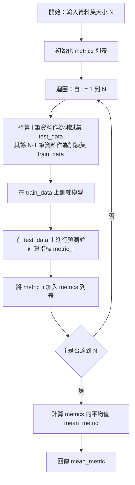
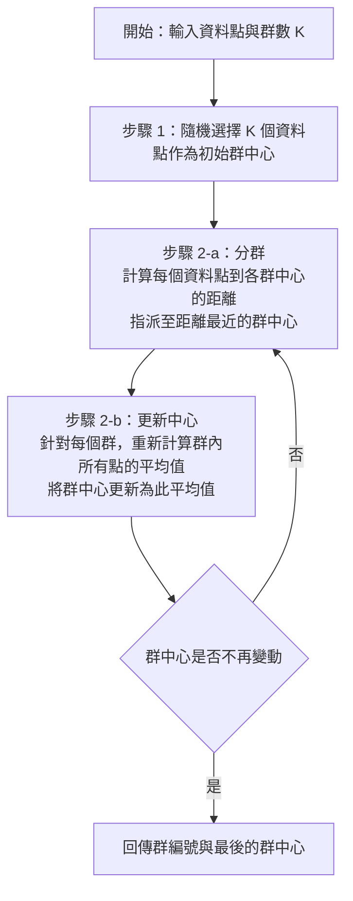

# 114年第二次 iPAS 中級 AI 應用規劃師 - 第二科「大數據處理分析與應用」
## 計算與程式考點深度解析

本文件針對 114 年 11 月 08 日公告之「中級能力鑑定 - 第二科：大數據處理分析與應用」學科試題中，所有涉及**數學計算、統計推論、演算法邏輯**以及 **Python 程式實作（Pandas、Scikit-learn、Statsmodels、Seaborn）**的題目進行深度剖析。

---

## 快速跳轉目錄
* [第一部分：核心統計與數學計算題解析](#第一部分核心統計與數學計算題解析)
  * [1. Z-Score 計算與異常值判定 (Q1, Q16)](#1-z-score-計算與異常值判定-q1-q16)
  * [2. 正規化吉尼不純度 (Normalized Gini Impurity) 計算 (Q14)](#2-正規化吉尼不純度-normalized-gini-impurity-計算-q14)
  * [3. 關聯規則計算（支持度、信賴度、提升度） (Q26)](#3-關聯規則計算支持度信賴度提升度-q26)
  * [4. 單樣本 t 檢定與信賴區間解讀 (Q23)](#4-單樣本-t-檢定與信賴區間解讀-q23)
  * [5. 二項分佈常態近似之邊界條件 (Q31)](#5-二項分佈常態近似之邊界條件-q31)
  * [6. 偏態 (Skewness) 判讀與統計基礎 (Q3, Q4)](#6-偏態-skewness-判讀與統計基礎-q3-q4)
* [第二部分：Python & Pandas 資料前處理與統計實作](#第二部分python--pandas-資料前處理與統計實作)
  * [1. 敘述性統計與 Pandas 基礎 (Q2, Q48)](#1-敘述性統計與-pandas-基礎-q2-q48)
  * [2. 缺失值 NaN 對資料型態的影響與解決方案 (Q43, Q44)](#2-缺失值-nan-對資料型態的影響與解決方案-q43-q44)
  * [3. 遺漏值偵測與統計 (Q49)](#3-遺漏值偵測與統計-q49)
  * [4. 資料分組與 Seaborn 視覺化繪圖 (Q45, Q46, Q47)](#4-資料分組與-seaborn-視覺化繪圖-q45-q46-q47)
* [第三部分：機器學習演算法與程式實作](#第三部分機器學習演算法與程式實作)
  * [1. 多元線性迴歸程式碼實作：Scikit-learn vs. Statsmodels (Q50)](#1-多元線性迴歸程式碼實作scikit-learn-vs-statsmodels-q50)
  * [2. 留一交叉驗證 (LOOCV) 虛擬碼與邏輯解析 (Q40)](#2-留一交叉驗證-loocv-虛擬碼與邏輯解析-q40)
  * [3. K-means 分群演算法虛擬碼與步驟解析 (Q41)](#3-k-means-分群演算法虛擬碼與步驟解析-q41)
  * [4. 卜瓦松分佈程式實作與機率計算 (Q15, Q42)](#4-卜瓦松分佈程式實作與機率計算-q15-q42)
  * [5. 資料前處理、特徵工程與模型評估考點彙整 (Q6, Q8, Q9, Q12, Q17, Q29, Q36, Q37, Q39)](#5-資料前處理特徵工程與模型評估考點彙整-q6-q8-q9-q12-q17-q29-q36-q37-q39)

---

## 第一部分：核心統計與數學計算題解析

### 1. Z-Score 計算與異常值判定 (Q1, Q16)

#### 核心公式
Z 分數（Z-Score）用於衡量某一數值相對於群體平均值偏離了多少個標準差：

$$Z = \frac{X - \mu}{\sigma}$$

其中：
* $X$ 為原始數據值。
* $\mu$ 為樣本平均數（Mean）。
* $\sigma$ 為樣本標準差（Standard Deviation）。

#### 試題剖析
* **第 1 題**：若某數據點的 Z 分數 = 2，代表該數據點比平均值高 2 個標準差（答案為 D）。
* **第 16 題**：平均值 $\mu = 2000$，標準差 $\sigma = 400$。某筆交易金額 $X = 3200$，且公司以 $|Z| \ge 3$ 判定為異常值（Outlier）。
  * 計算該筆交易的 Z 分數：
    $$Z = \frac{3200 - 2000}{400} = \frac{1200}{400} = 3$$
  * 由於 $Z = 3$，滿足 $|Z| \ge 3$，故該筆交易應被標記為異常值（答案為 A）。

---

### 2. 正規化吉尼不純度 (Normalized Gini Impurity) 計算 (Q14)

#### 核心公式
吉尼不純度（Gini Impurity）常用於決策樹演算法中，評估分類節點的純度。公式如下：

$$Gini(D) = 1 - \sum_{i=1}^{k} p_i^2$$

其中 $p_i$ 為節點中屬於第 $i$ 類別的樣本比例， $k$ 為類別總數。
對於二分類問題（$k=2$）：
* 當節點完全純淨（例如全部為 A 類別），則 $p_A = 1, p_B = 0 \Rightarrow Gini = 1 - (1^2 + 0^2) = 0$。
* 當節點最不純淨（A 與 B 各佔一半），則 $p_A = 0.5, p_B = 0.5 \Rightarrow Gini = 1 - (0.5^2 + 0.5^2) = 0.5$。因此，二分類下 $Gini_{max} = 0.5$。

**正規化吉尼不純度（Normalized Gini Impurity）** 是將計算出來的吉尼不純度除以該分類任務下最大可能的吉尼不純度：

$$Normalized\ Gini = \frac{Gini(D)}{Gini_{max}}$$

#### 試題剖析
* **第 14 題**：某組資料共 10 項標籤：`A, A, A, A, A, B, B, B, B, B`。
  * 統計數量：A 類別有 5 項，B 類別有 5 項。
  * 計算機率：$p_A = \frac{5}{10} = 0.5$；$p_B = \frac{5}{10} = 0.5$。
  * 計算吉尼不純度：
    $$Gini = 1 - (0.5^2 + 0.5^2) = 1 - (0.25 + 0.25) = 0.5$$
  * 計算二分類的最大吉尼不純度：$Gini_{max} = 0.5$。
  * 計算正規化吉尼不純度：
    $$Normalized\ Gini = \frac{0.5}{0.5} = 1$$
  * 因此答案為 D（正規化吉尼不純度為 1）。

---

### 3. 關聯規則計算（支持度、信賴度、提升度） (Q26)

#### 核心公式
關聯規則學習中，定義規則 $A \rightarrow B$ （例如：買了 A 商品，也會買 B 商品）有三個關鍵指標：

1. **支持度 (Support)**：代表 $A$ 與 $B$ 同時發生的機率。
   $$Support(A \rightarrow B) = P(A \cap B)$$
2. **信賴度 (Confidence)**：代表在 $A$ 發生的前提下， $B$ 也發生的條件機率。
   $$Confidence(A \rightarrow B) = P(B|A) = \frac{P(A \cap B)}{P(A)}$$
3. **提升度 (Lift)**：代表規則 $A \rightarrow B$ 的信賴度，與「只考慮 $B$ 單獨發生機率」的比值。用以衡量 $A$ 的出現對 $B$ 的出現有多少提升作用。
   $$Lift(A \rightarrow B) = \frac{Confidence(A \rightarrow B)}{P(B)} = \frac{P(A \cap B)}{P(A) \cdot P(B)}$$
   * $Lift > 1$：正相關（有商業價值的關聯規則）。
   * $Lift = 1$：相互獨立。
   * $Lift < 1$：負相關（互斥）。

#### 試題剖析
* **第 26 題**：規則為「看科幻影集 $\rightarrow$ 看超級英雄電影」。
  * 同時觀看這兩種類型的使用者佔全部的 $12\%$ $\Rightarrow P(\text{科幻} \cap \text{英雄}) = 0.12$（支持度為 12%）。
  * 觀看科幻影集的使用者中，有 $50\%$ 也觀看了超級英雄電影 $\Rightarrow Confidence(\text{科幻} \rightarrow \text{英雄}) = 0.50$（信賴度為 50%）。
  * 提升度 $Lift = 1.8$。
  * 藉由公式推導超級英雄電影的單獨觀看機率 $P(\text{英雄})$：
    $$Lift = \frac{Confidence}{P(\text{英雄})} \Rightarrow 1.8 = \frac{0.50}{P(\text{英雄})} \Rightarrow P(\text{英雄}) = \frac{0.50}{1.8} \approx 27.78\%$$
  * 選項分析：
    * (A) 支持度為 12%，不算極低且具有一定的樣本代表性，並非不具商業價值。
    * (B) 提升度 $1.8 > 1$，代表兩者呈現正相關而非無關。
    * (C) 信賴度（Confidence）為 50%，代表觀看科幻影集者有明顯傾向觀看超級英雄電影（正確答案）。
    * (D) 同時觀看比例為 12%，並非互相排斥（若排斥則同時觀看比例應接近 0%）。

---

### 4. 單樣本 t 檢定與信賴區間解讀 (Q23)

#### 核心概念
* **虛無假設 ($H_0$)**：設定為無差異或無效應的狀態。在本題中 $H_0: \mu = 100$ 萬元。
* **顯著水準 ($\alpha$)**：通常設為 0.05。
* **p 值 (p-value)**：若 $p\text{-value} < \alpha$，拒絕虛無假設 $H_0$；若 $p\text{-value} \ge \alpha$，無法拒絕虛無假設 $H_0$。
* **信賴區間 (Confidence Interval, CI)**：若給定的顯著水準下，$H_0$ 的檢定值（本題中為 100）落在該顯著水準對應的信賴區間內，則在統計上無法拒絕虛無假設。

#### 試題剖析
* **第 23 題**：顯著水準設定為 $\alpha = 0.05$。檢定結果 $p\text{-value} = 0.08$，95% 信賴區間為 $[95, 108]$ 萬元。
  * 由於 $p\text{-value} = 0.08 > 0.05$，代表在 $\alpha = 0.05$ 的水準下不顯著，**無法拒絕虛無假設**（排除 A 選項）。
  * 檢定值 100 萬元正好落在信賴區間 $[95, 108]$ 之間，這在數學上等價於「無法拒絕虛無假設」（答案為 C）。
  * 若顯著水準改為 $\alpha = 0.10$（對應 90% 信賴區間），因 $p\text{-value} = 0.08 < 0.10$，此時將會拒絕虛無假設（變為顯著），因此 (B) 選項錯誤。
  * 信賴區間寬度除了與顯著水準有關外，也與樣本標準差及樣本數有關，因此 (D) 選項錯誤。

---

### 5. 二項分佈常態近似之邊界條件 (Q31)

#### 核心公式
若隨機變數 $X$ 服從二項分佈 $B(n, p)$，當試驗次數 $n$ 足夠大時，$X$ 可以近似為期望值為 $np$、變異數為 $n(1-p)$ 的常態分佈：

$$X \sim N\left(np, np(1-p)\right)$$

#### 邊界條件
為了保證常態近似的合理性與對稱性，必須限制二項分佈不能過於偏斜。最常用的經驗法則為：

$$np \ge 5 \quad \text{且} \quad n(1-p) \ge 5$$

（部分教科書要求更嚴格的 $\ge 10$ 或 $\ge 15$。但考試選項以 5 為依據。）

#### 試題剖析
* **第 31 題**：單次成功機率 $p=0.4$，擴增至 $n=5,000$。預估成功數的分佈，判斷何者合理？
  * 計算條件：$np = 5000 \times 0.4 = 2000 \ge 5$， $n(1-p) = 5000 \times 0.6 = 3000 \ge 5$。
  * 只有滿足此經驗法則，才能使用常態分佈近似二項分佈（答案為 B）。

---

### 6. 偏態 (Skewness) 判讀與統計基礎 (Q3, Q4)

#### 偏態判讀 (Q3)
* **右偏（正偏態，Skewness > 0）**：尾巴向右拉長，中位數 < 平均值。
* **左偏（負偏態，Skewness < 0）**：尾巴向左拉長，中位數 > 平均值。
* **對稱（無偏態，Skewness = 0）**：左右對稱（如常態分佈）。
* **試題剖析**：第 3 題附圖顯示資料在低數值區（左側，如 0 至 -20 之間）有長尾分佈，高數值區（右側）陡然下降。這是典型的**左偏分佈**，因此其偏態值較有可能為 **Skewness < 0**（答案為 A）。

#### 累積分布函數 (CDF) 定義 (Q4)
* **數學定義**：累積分布函數 $F(x)$ 定義為隨機變數 $X$ 小於或等於某個值 $x$ 的機率。對於連續型隨機變數，它是機率密度函數 (PDF) $f(t)$ 從 $-\infty$ 到 $x$ 的積分：
  $$F(x) = P(X \le x) = \int_{-\infty}^{x} f(t) dt$$
* **試題剖析**：第 4 題中，CDF 的數學定義即為機率密度函數 (PDF) 的積分（答案為 B）。

---

## 第二部分：Python & Pandas 資料前處理與統計實作

### 1. 敘述性統計與 Pandas 基礎 (Q2, Q48)

#### 敘述性統計常用語法
在 Pandas 中處理 DataFrame （變數為 `df`）時，若要快速查看某欄位的描述性統計量（包括總個數、平均值、標準差、最小值、四分位數及最大值），應使用 `describe()` 方法：

```python
# 針對特定欄位輸出描述性統計
df['總銷售額'].describe()
```

* `sum()`：計算數值總和（Q2 的 A 選項）。
* `sort_values()`：排序資料（Q2 的 C 選項）。
* `describe()`：輸出描述性統計（Q2 的正確答案 B）。

#### 統計報表解讀 (Q48)
第 48 題要求解讀下方的 `df.describe()` 輸出報表：

| 統計量 | youtube | facebook | newspaper | sales |
| :--- | :--- | :--- | :--- | :--- |
| **count** | 200.000000 | 199.000000 | 200.000000 | 200.000000 |
| **mean** | 176.451000 | 27.820101 | 36.664800 | 16.827000 |
| **std** | 103.025084 | 17.808410 | 26.134345 | 6.260948 |
| **min** | 0.840000 | 0.000000 | 0.360000 | 1.920000 |
| **25% (Q1)** | 89.250000 | 11.940000 | 15.300000 | 12.450000 |
| **50% (Q2)** | 179.700000 | 27.000000 | 30.900000 | 15.480000 |
| **75% (Q3)** | 262.590000 | 43.680000 | 54.120000 | 20.880000 |
| **max** | 355.680000 | 59.520000 | 136.800000 | 32.400000 |

* **選項分析**：
  * (A) 資料集個數在部分欄位只有 199 筆（facebook），但整個資料集最大樣本數為 200 筆，且變數個數包括四個（youtube, facebook, newspaper, sales），因此「資料集個數為 199 筆」不正確。
  * (B) `sales` 變數的中位數（即 50% 分位數）是 **15.48**，而非平均值 16.827，因此錯誤。
  * (C) `facebook` 變數的第三四分位數 (Q3) 是 **43.68**，而 11.94 是第一四分位數 (Q1)，因此錯誤。
  * (D) `youtube` 變數的第一四分位數 (Q1) 是 **89.25**（正確答案，選 D）。

---

### 2. 缺失值 NaN 對資料型態的影響與解決方案 (Q43, Q44)

#### 為什麼整數年份讀入後會變成 `float64`？ (Q43)
在 Pandas 中，常見的 `numpy.int64` 屬於原生 C 語言型態，**不支援缺失值 (NaN) 的儲存**。
如果 CSV 檔案中的整數欄位（如年份 Year）包含了缺失值：
1. Pandas 在讀取檔案時遇到空值，會將空值解析為 `numpy.nan`（其資料型態在 Python 中屬於浮點數 `float`）。
2. 為了解決整數與 `numpy.nan` 共存的問題，Pandas 會強制將整欄的型態向上轉型（Upcast）為 `float64`。
3. 此外，如果原始 CSV 內的年份寫成 `2006.0` 這種帶小數點的格式，也會被直接識別為浮點數。
* **第 43 題答案**：原因 A（含有缺失值 NaN）與 原因 D（資料中包含小數點如 2006.0）會導致此現象（答案為 B）。

#### 如何正確將含有缺失值的欄位轉換為整數？ (Q44)
如果直接對含有 `NaN` 的浮點數欄位呼叫 `.astype(int)`：
```python
# 報錯：IntCastingNaNError: Cannot convert non-finite values (NA or inf) to integer
data['Year'].astype(int)
```

為了在保留缺失值的狀態下，將其他數值轉為整數，Pandas 自 0.24 版本起引入了**可空整數類型（Nullable Integer Data Type）**，其型態名稱為大寫開頭的 **`'Int64'`**：

```python
# 正確轉換方式
data['Year'] = data['Year'].astype('Int64')
```

* 註：使用 `.fillna(0).astype(int)` 雖不會報錯，但會將所有缺失年份竄改為 0 年，這在數據分析中是不合理的做法。
* **第 44 題答案**：(D) `data['Year'] = data['Year'].astype('Int64')`。

---

### 3. 遺漏值偵測與統計 (Q49)

在 Pandas 中，判斷 DataFrame 內是否含有 NaN 並統計個數，可以使用以下兩個語法：
* **`df.isnull().sum()`**
* **`df.isna().sum()`**

這兩者在 Pandas 底層是完全等價的（`isna()` 是 `isnull()` 的別名）。
* **第 49 題答案**：(C) 選項 A 與 選項 C 皆正確。

---

### 4. 資料分組與 Seaborn 視覺化繪圖 (Q45, Q46, Q47)

#### 資料分組聚合繪圖 (Q45)
若要統計各個遊戲平台（`Platform`）的全球銷售總額（`Global_Sales`），並以長條圖呈現：
1. **分組與運算**：使用 `.groupby("Platform")["Global_Sales"].sum()`。
2. **繪圖**：接續呼叫 `.plot(kind="bar")`。
* **第 45 題答案**：(A) `data.groupby("Platform")["Global_Sales"].sum().plot(kind="bar")`。

#### 多變量資料寬轉長與 Seaborn 條形圖 (Q46)
在 Seaborn 中，如果我們要在一張圖上繪製多個欄位（例如：`NA_Sales`、`EU_Sales`、`JP_Sales`、`Other_Sales`）的總額對比，通常需要先將 DataFrame 從「寬格式（Wide Format）」轉換為「長格式（Long Format）」：
* 使用 **`pd.melt()`** 函數將多個銷售欄位融合。
* 轉換後會自動生成 `variable`（放原欄位名稱）與 `value`（放對應的數值）兩欄。
* 接續使用 `sns.barplot` 進行統計繪圖，透過 `estimator=sum` 計算各區總額：

```python
sns.barplot(
    x="variable", 
    y="value", 
    data=pd.melt(data, value_vars=["NA_Sales", "EU_Sales", "JP_Sales", "Other_Sales"]),
    estimator=sum
)
```

* **第 46 題答案**：(C)。

#### 篩選最大值並使用 Seaborn 繪製 (Q47)
若要找出北美地區（`NA_Sales`）銷售最好的前五名遊戲並以長條圖顯示：
1. **篩選前五名**：使用 `data.nlargest(5, "NA_Sales")`。
2. **Seaborn 繪圖**：`sns.barplot(x="Name", y="NA_Sales", data=...)`，其中 X 軸放遊戲名稱，Y 軸放銷售額。
* **第 47 題答案**：(B) `sns.barplot(x="Name", y="NA_Sales", data=data.nlargest(5, "NA_Sales"))`。

---

## 第三部分：機器學習演算法與程式實作

### 1. 多元線性迴歸程式碼實作：Scikit-learn vs. Statsmodels (Q50)

在 Python 中進行線性迴歸，最常用的兩個套件分別是 Scikit-learn 與 Statsmodels。它們在語法設計上有顯著的差異。

#### 比較表

| 項目 | Scikit-learn (`linear_model.LinearRegression`) | Statsmodels (`sm.OLS`) |
| :--- | :--- | :--- |
| **引入方式** | `from sklearn.linear_model import LinearRegression` | `import statsmodels.api as sm` |
| **自動擬合截距** | 預設自動擬合（可用 `fit_intercept=False` 關閉） | 預設不包含截距，須手動加上 `sm.add_constant(X)` |
| **訓練擬合語法** | `.fit(X, y)` （**先自變數 X，後應變數 y**） | `sm.OLS(y, X).fit()` （**先應變數 y，後自變數 X**） |
| **主要回傳變數** | 模型物件 `reg`，使用 `.coef_` 取得係數， `.intercept_` 取得截距 | 擬合結果物件 `model_sm`，使用 `.summary()` 取得完整報表 |

#### 試題分析 (Q50)
考慮題目中的程式碼填空與執行結果：
```python
from sklearn.linear_model import LinearRegression
import statsmodels.api as sm

X = df[['youtube', 'facebook', 'newspaper']]
y = df['sales']

# 空格 1 (Scikit-learn 訓練)
reg = LinearRegression().fit(X, y)
print(reg.coef_)

X2 = sm.add_constant(X)
# 空格 2 (Statsmodels OLS 訓練)
model_sm = sm.OLS(y, X2).fit()
print(model_sm.summary())
```

* **空格 1** 必須填入 `reg = LinearRegression().fit(X, y)`，自變數 $X$ 放在前面（選項 B）。
* **空格 2** 必須填入 `sm.OLS(y, X2).fit()`，應變數 $y$ 放在前面，且自變數使用加上常數項後的 $X2$（選項 D 語法寫反，故 D 錯誤）。
* **報表指標解讀**：
  * **截距項係數 (const)** 數值為 **3.5561**（F 正確）。
  * **R-squared** = 0.898，代表此模型可解釋 89.8% 的應變數變異。
  * **各自變數顯著性 (P>|t|)**：
    * `const` 的 p 值 = 0.000 (< 0.05，顯著)
    * `youtube` 的 p 值 = 0.000 (< 0.05，顯著)
    * `facebook` 的 p 值 = 0.000 (< 0.05，顯著)
    * `newspaper` 的 p 值 = 0.914 (> 0.05，**不顯著**)
  * 由於 `newspaper` 不顯著，代表並非「所有」迴歸係數都具有顯著的解釋力，因此 E 錯誤。
  * `print(reg.coef_)` 只會輸出自變數的係數，不包含截距項，因此只有 3 個係數值，C 錯誤。
* **結論**：選項 B 與 F 正確，故第 50 題答案為 **(B) B、F**。

---

### 2. 留一交叉驗證 (LOOCV) 虛擬碼與邏輯解析 (Q40)

#### 核心邏輯
留一交叉驗證（Leave-One-Out Cross Validation）是 K-Fold 交叉驗證的一種極端特例（當 $K = N$， $N$ 為總樣本數）。
* **機制**：每次只將「1 筆」資料作為測試集，剩下的 $N-1$ 筆資料作為訓練集。此過程重複 $N$ 次，直到每筆資料都當過一次測試集為止。
* **優點**：每次模型訓練都使用了幾乎全部的資料，估計值非常穩定且無偏差。
* **缺點**：如果 $N$ 很大，模型必須訓練 $N$ 次，計算開銷極高。

#### 流程圖 (LOOCV 邏輯)


#### 試題剖析
* **第 40 題**：虛擬碼中 `a. 將第 i 筆資料作為測試集 test_data`；`b. 將其餘 N-1 筆資料作為訓練集 train_data`。這完全符合 LOOCV 的定義（答案為 B）。

---

### 3. K-means 分群演算法虛擬碼與步驟解析 (Q41)

#### 核心邏輯
K-means 是一種非監督式學習的距離型分群演算法，目標是將 $N$ 筆資料點劃分到 $K$ 個群集中，使群集內的點與群中心的距離平方和最小。

#### 流程圖 (K-means 步驟)


#### 試題剖析
* **第 41 題**：虛擬碼步驟 1 隨機選擇初始中心，步驟 2 重複計算距離分群並更新中心，直到收斂。此即為經典的 K-means 分群演算法（答案為 A）。

---

### 4. 卜瓦松分佈程式實作與機率計算 (Q15, Q42)

#### 核心數學公式
卜瓦松分佈（Poisson Distribution）用於描述在**固定時間間隔或空間內，某隨機事件發生次數**的機率分佈。
* **適用條件**：
  1. 事件彼此獨立。
  2. 在極短時間內，事件發生的機率與時間長度成正比。
  3. 平均發生率（通常記為 $\lambda$，在 Python 中常寫為 `lambda` 或 `mu`）固定。
* **機率質量函數 (PMF)**：計算事件剛好發生 $k$ 次的機率：
  $$P(X = k) = \frac{e^{-\lambda} \lambda^k}{k!}$$
* **累積分布函數 (CDF)**：計算事件發生次數小於或等於 $k$ 次的機率：
  $$P(X \le k) = \sum_{i=0}^{k} \frac{e^{-\lambda} \lambda^i}{i!}$$

#### 試題剖析
* **第 15 題**：客服中心平均每小時接到 20 通電話，每分鐘來電數量不固定，事件獨立且發生機率與時間成正比。求每分鐘接到幾通電話的機率分佈？這完全符合卜瓦松分佈的特徵（答案為 C）。
* **第 42 題**：平均每小時產生 5 個瑕疵品 ($\lambda = 5$)。給定 Python 程式碼：
  ```python
  import numpy as np
  from scipy.stats import poisson
  lambda_poisson = 5
  print(poisson.pmf(5, lambda_poisson))
  ```
  * **選項分析**：
    * (A) `lambda_poisson = 5` 代表**平均每小時**產生 5 個瑕疵品，而非最多 5 個，故 A 錯誤。
    * (B) `poisson.pmf(5, lambda_poisson)` 計算的是**剛好等於 5** 的機率，而非小於 5，故 B 錯誤。
    * (C) 卜瓦松分佈的適用條件為事件彼此獨立，且平均發生率固定（正確答案，選 C）。
    * (D) `poisson.cdf(10, 5)` 代表事件發生次數**小於或等於 10** 的機率，而非大於或等於 10，故 D 錯誤。

---

### 5. 資料前處理、特徵工程與模型評估考點彙整 (Q6, Q8, Q9, Q12, Q17, Q29, Q36, Q37, Q39)

#### A. Box-Cox 轉換與異質變異數處理 (Q36)
* **場景**：在線性迴歸分析中，若應變數 $Y$ 呈現**右偏分佈**，且其殘差變異數隨自變數 $X$ 增大而增加（即存在**異質變異數 Homoscedasticity 違背**）。
* **解決方案**：對應變數 $Y$ 進行 **Box-Cox 轉換**（Box-Cox Transformation），使其更接近常態分佈並穩定變異數（答案為 B）。

#### B. 存在離群值時的標準化 (Q9)
* **場景**：若資料中存在極端值（Outliers），常規的 Min-Max Scaling 或 Z-Score 容易受到極端值的拉扯而失效。
* **解決方案**：應使用 **穩健縮放（Robust Scaling）**。它使用中位數（Median）和四分位距（IQR）來進行縮放，不容易受離群值影響：
  $$X_{scaled} = \frac{X - Median}{IQR}$$
  * **第 9 題答案**：(C) Robust Scaling。

#### C. PCA 降維前的標準化必要性 (Q29)
* **原理**：PCA 是尋找資料中變異數最大的投影方向。若欄位間的變數量級差異極大（如 10⁵ 與 10¹），量級大的欄位會完全主導主成分（PC1），導致結果偏誤。
* **解決方案**：在進行 PCA 前，必須進行**標準化（Standardization）**處理，以消除量綱與量級影響。
  * **第 29 題答案**：(D) 應先進行標準化，以避免數值尺度差異造成特徵偏誤。

#### D. 類別型變數編碼之潛在風險 (Q6, Q17)
* **Label Encoding**：直接以整數 (0, 1, 2...) 代替類別。
  * **風險**：若應用於無順序關係的類別（Nominal，如「一般、白金、黑卡」），容易讓模型誤判變數間存在數值大小或順序關係。
  * **第 17 題答案**：(B) 直接使用標籤編碼可能使模型誤判類別間存在順序關係。
* **One-Hot Encoding**：
  * **風險**：若遇到高基數特徵（High Cardinality，即類別數量非常多），會轉換出極多維的疏鬆矩陣，造成維度爆炸問題。
  * **第 6 題答案**：(C) 錯誤敘述為「標準化會將數值範圍壓縮至 0 至 1 之間」（這是 Min-Max 正規化的效果，標準化是將資料轉為平均值為 0、標準差為 1，但數值範圍不限於 0 到 1）。

#### E. 不平衡資料處理與交叉驗證 (Q12, Q37, Q39)
* **過採樣（Random Oversampling）的缺點**：由於簡單複製少數類別的樣本，極易導致模型在訓練集上產生**過擬合（Overfitting）**（Q12 答案為 A）。
* **SMOTE 演算法**：針對少數類別，利用近鄰點插值生成「合成的新樣本」，既能平衡資料，又能有效降低過擬合風險。
  * **第 37 題答案**：(C) 使用 SMOTE 生成合成少數類樣本後再訓練。
* **分層交叉驗證 (Stratified K-Fold)**：在分類問題且類別不平衡（如 80% 良性腫瘤）時，若使用一般的交叉驗證，可能導致每折（Fold）的類別比例不均。使用分層交叉驗證可確保每一折的類別比例與原始資料集完全一致，避免效能評估偏差。
  * **第 39 題答案**：(D) 使用分層交叉驗證（Stratified K-Fold Cross-Validation）。
