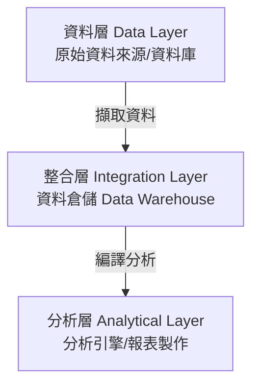

# 📚 IPAS 營運智慧分析師 學習筆記
## 【單元 A】企業資訊系統與大腦 (BI/OI/ERP/SCM/CRM/PLM/RPA)

本單元整合了考科一與考科二中關於**企業核心資訊系統**、**系統架構**以及**資料倉儲與 ETL** 的所有必考重點。

---

### 💡 核心生活譬喻：如何開一家「會賺錢的智慧餐廳與連鎖店」？

在學習這些複雜的系統名詞前，我們可以用**餐廳與手搖飲店**的日常運作來理解它們的定位：
*   **ERP（企業資源規劃）**：店裡的 **「大掌櫃」**。管全店帳目、每天賣出多少杯飲料、盤點倉庫剩多少原物料，把所有內部資源整合在同一個集中式資料庫中。
*   **SCM（供應鏈管理）**：店裡的 **「物流大總管」**。算各家分店茶葉夠不夠、明天甘蔗汁要運多少過去、下週大熱天要提早多訂多少原料。
*   **CRM（客戶關係管理）**：店裡的 **「超級公關」**。記錄熟客偏好（例如：王小姐每週三點珍奶），並在王小姐生日時自動發送 8 折券。
*   **PLM（產品生命週期管理）**：店裡的 **「研發實驗室」**。管理從「起司奶蓋芒果冰沙」的點子、配方調配（**BOM 表/配方結構**），直到上市和被淘汰的完整生命週期。

---

### 1. 決策大腦：BI (商業智慧) vs OI (營運智慧)

企業每天都在產生數據，如何利用這些數據做決定？

*   **商業智慧 (BI, Business Intelligence)**：
    *   *定義*：運用資訊科技工具，從大量歷史營運資料中分析與整理出有價值的經營資訊，改善企業營運績效，**提升組織的競爭優勢**。
    *   *譬喻*：餐廳老闆在 **「看上個月的財務報表」**，決定下個月要不要換菜單或開分店（著重**過去/歷史資料、長期策略**）。
*   **營運智慧 (OI, Operations Intelligence)**：
    *   *定義*：將商業智慧分析應用於企業營運模式中的**動態系統**，運用即時、整合的資訊科技，蒐集並分析跨部門流程資訊。
    *   *譬喻*：主廚在 **「看即時的點單螢幕與庫存」**，發現某一條魚快賣完了，立刻通知外場不要再推這道菜（著重**現在、即時 Real-time、動態監控**）。
    *   > [!IMPORTANT]
        > **出題盲點**：考題很愛考「即時性」，只要看到題目描述 **「即時 (Real-time)」**、**「動態監控」**，答案選 **OI** 就對了。

---

### 2. 營運智慧 (OI) 的三層架構與餐廳做菜流程

營運智慧系統組成架構包括三個層次，我們可以用餐廳做菜的流程來對應：

1.  **資料層 (Data Layer)**：
    *   *定義*：資訊源，指資料所在的資料庫或其應用軟體（如 ERP、CRM 中的交易數據）。
    *   *譬喻*：廚房後門剛運到的 **「原始食材」**。
2.  **整合層 (Integration Layer)**：
    *   *定義*：資料倉儲 (Data Warehouse)，在分析之前將來自各種不同來源的資料進行編譯。
    *   *譬喻*：中央廚房的 **「備料區」**，把菜洗好、切好、分類放進保鮮盒。
3.  **分析層 (Analytical Layer)**：
    *   *定義*：資料本身的分析與決策報表製作。
    *   *譬喻*：大廚根據客人的需求，將備好的料烹調成 **「美味的佳餚（視覺化看板、KPI 報表）」**。

---

### 3. 企業核心管理系統對照表

| 系統名稱（英文縮寫） | 核心定義與考試重點 | 譬喻角色 |
| :--- | :--- | :--- |
| **ERP** (Enterprise Resource Planning) | 整合整體企業的管理功能（包含財務、製造、銷售、人資）。主要功能包括：**將流程自動整合**、**使用共同的集中式資料庫**、**即時提供資訊**。導入時通常遵循**產業最佳實務 (Best Practice)** 流程。 | **大掌櫃** |
| **MRP** (Material Requirements Planning) | 屬於 ERP 的核心，專門規劃與計算生產所需的物料取得時間與數量。 | **原料採購單** |
| **SCM** (Supply Chain Management) | 整合上下游（供應商、製造商、零售商）物流、採購與銷售預測。分為**規劃系統**（需求預測、生產計畫）與**執行系統**（管理物料與成品流動）。 | **物流大總管** |
| **CRM** (Customer Relationship Management) | 協助企業與客戶維持良好關係，儲存顧客屬性資料與行銷活動資料。**資料探勘 (Data Mining)** 是分析型 CRM 的核心技術。 | **超級公關** |
| **PLM** (Product Life-cycle Management) | 協助企業瞭解並管理產品從研發、設計、上市到淘汰的詳細狀況。**核心是控管物料清單 (BOM) 與配方結構**。 | **研發實驗室** |
| **RPA** (Robotic Process Automation) | **機器人流程自動化**。利用軟體機器人模擬人類在電腦上的鍵盤與滑鼠操作，自動執行**重複性高、規則明確**的任務（如資料輸入、複製貼上），可確保資料一致性並降低成本。 | **自動化小幫手** |

#### 💡 供應鏈 (SCM) 的三種模式：
1.  **推式 (Push) 供應鏈**：依據歷史資料**預測**需求，主動計劃生產並推向市場（預測導向）。
2.  **拉式 (Pull) 供應鏈**：等到取得**實際客戶訂單**後才啟動生產流程，交付產品（訂單導向）。
3.  **推拉式 (Push-Pull) 供應鏈**：結合兩者。前半段（零組件採購與半成品生產）為推式，後半段（依訂單組裝成成品）為拉式。

---

### 4. 決策分析的雙雄：假設分析 vs 目標搜尋

在商業決策中，這兩個功能經常成對出現，也是**絕對必考的對比題**：

*   **假設分析 (What-if Analysis)**：
    *   *定義*：建立多種變數之間的關係模型，使用者**變更某些解釋變數**，觀察其對因變數（結果）的影響（**改變參數，預測未來結果**）。
    *   *譬喻*：**「如果」** 我把便當從 100 元漲到 120 元，下個月的利潤會變多少？
*   **目標搜尋 (Goal Seeking)**：
    *   *定義*：使用者**設定某個特定的目標值**，要求系統反推需要改變哪些變數才能達到該目標（**給定目標，反推達成條件**）。
    *   *商用工具*：通常建立在 Excel 模型上。
    *   *譬喻*：我下個月 **「目標」** 要賺 20 萬元，反推我的便當 **應該** 要賣多少錢、一天要賣幾個？

---

### 5. 數據呈現：OLAP (線上分析處理)

*   **OLAP (On-Line Analytical Processing)**：
    *   *定義*：一種資料分析處理軟體，允許使用者深入探究資料，將資料倉儲內的龐大資料進行**切細分塊**，以揭露隱藏的模式或趨勢。
    *   *譬喻*：就像一個「魔術方塊」或「多層結婚蛋糕」。老闆看營業額，可以轉動方塊：按「時間（第一季）」看、按「地區（台北店）」看、按「產品（牛肉麵）」看。
    *   *關鍵動作*：**切片 (Slice)**、**切塊 (Dice)**、**鑽取 (Drill-down / Drill-up)**。

---

### 6. 資料倉儲系統的建置與 ETL 流程

#### 🛠️ ETL（蒐集-轉換-載入）
資料進入資料倉儲前，必須經過 **ETL (Extract, Clean, Conform, Delivery / ECCD)** 流程：
1.  **萃取 (Extract)**：從原始資料來源（如 ERP 交易庫）萃取資料。
2.  **清理 (Clean)**：確保資料品質，處理缺失值、極端值、重複資料，剔除髒資料。
3.  **一致化 (Conform)**：將不同來源的資料格式對齊一致（例如：將所有日期格式統一為 YYYY-MM-DD）。
4.  **交付 (Delivery)**：將清理好的一致化資料，以規範格式載入資料倉儲，交付給終端使用者進行分析。

#### 📐 資料倉儲建置之「規劃與設計流程」四步驟（順序必考）：
> [!IMPORTANT]
> **需求與現況 (Requirements & Realities)** ➔ **架構設計 (Architecture)** ➔ **系統建置 (System Implementation)** ➔ **測試與發布 (Test & Release)**

---

### 🔑 核心專有名詞英翻中對照表

| 英文專有名詞 | 中文翻譯 | 考試核心記憶點 |
| :--- | :--- | :--- |
| **Operations Intelligence (OI)** | 營運智慧 | 企業營運模式中的**動態系統**，強調**即時性**。 |
| **Business Intelligence (BI)** | 商業智慧 | 從大量資料中萃取智慧，著重**歷史與長期決策**。 |
| **Data Warehouse (DW)** | 資料倉儲 | 中央化資料儲存庫，儲存多源整合資料以供分析。 |
| **ETL (Extract-Transform-Load)** | 萃取-轉換-載入 | 資料進入資料倉儲的基礎，包含 **ECCD** 流程。 |
| **Balanced Scorecard (BSC)** | 平衡計分卡 | 四構面管理策略：**財務、顧客、流程、學習與成長**。 |
| **Key Performance Indicator (KPI)** | 關鍵績效指標 | 衡量邁向既定目標進度的量化指標。 |
| **What-if Analysis** | 假設分析 | 變更自變數，觀測結果的變化（如果...會怎樣）。 |
| **Goal Seeking** | 目標搜尋 | 設定最終目標值，反向推算應達成的輸入條件。 |
| **OLAP** | 線上分析處理 | 多維度資料分析工具，允許資料**切細分塊 (Slice/Dice)**。 |
| **RPA** | 機器人流程自動化 | 用軟體機器人自動化重複性、規則明確的電腦操作。 |
| **Metadata** | 詮釋資料 | **描述資料的資料**（定義欄位、名稱、型態與位置）。 |
| **In-memory Computing** | 記憶體內運算 | 提升計算速度，讓數據分析結果更快顯現。 |
